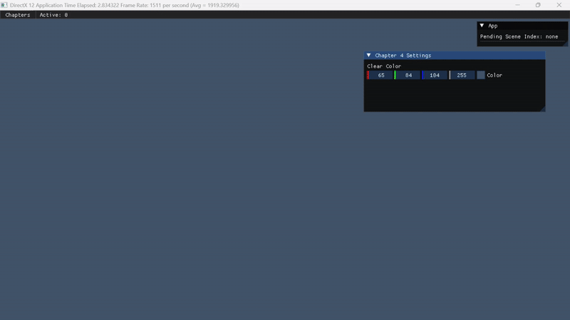
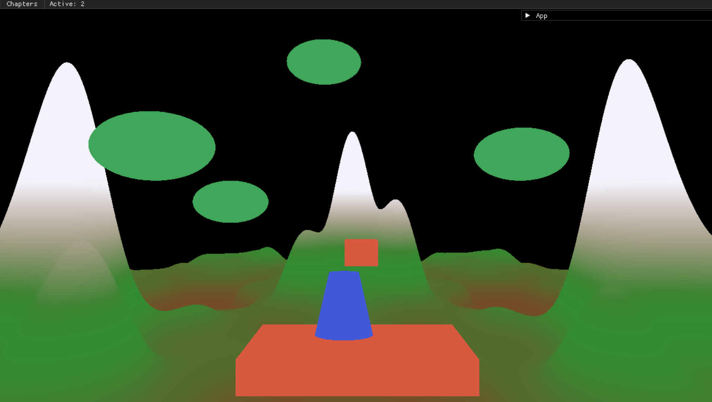
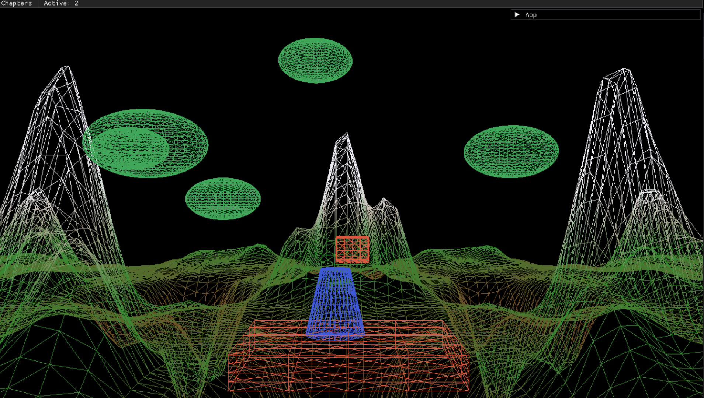

# DirectX 12 Frank Luna: Chapters with Answers

This repo is my **DirectX 12 learning playground** built while following the **Frank Luna DirectX 12 textbook**.

``NOT A REPLICA``
---

## Current Output

### Chapter 4


> Chapter 4 in the book doesn’t include exercise questions, so there are **no answers** for that chapter — only the working output.

---

### Chapter 6 with all the programming answers


**Showcase Video:**  
[▶ Watch Chapter 6 Showcase](outputs/chapter-6/showcase.mp4)

---

### Chapter 7



---

### Chapter 8 — Lights (In Progress)

---

## What’s Inside

- **Chapter-based scenes**  
  Each textbook chapter is treated as a selectable scene/module.

- **Exercise answers**  
  Implementations are provided where the book includes questions.

- **ImGui controls**

---

## Build & Run

```bash
cmake -S . -B build -G "Visual Studio 17 2022"
# Build (Debug or Release both are fine)
cmake --build build --config Release
